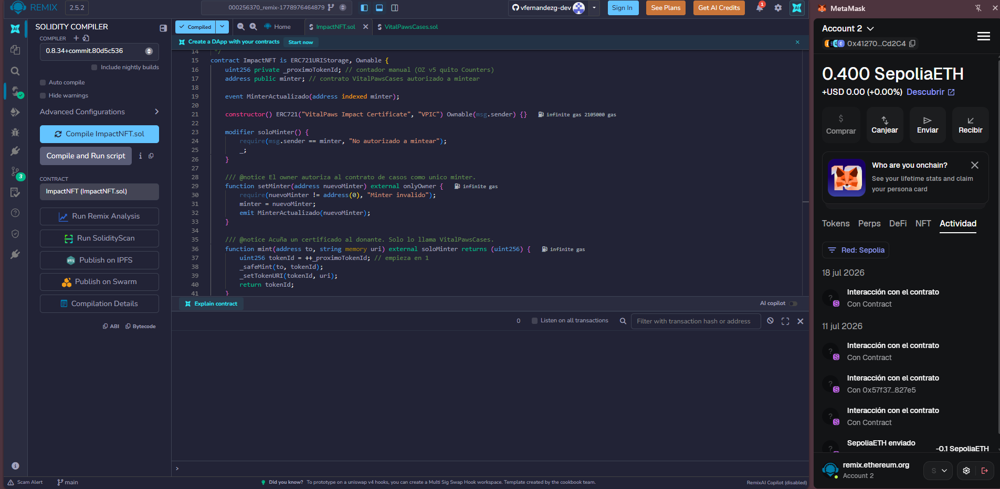
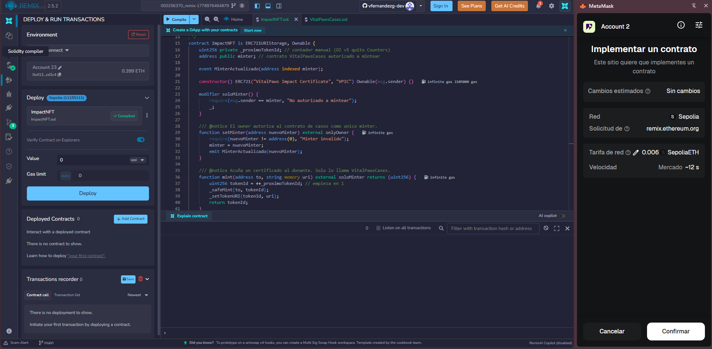
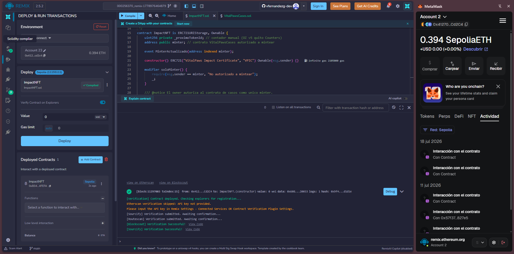
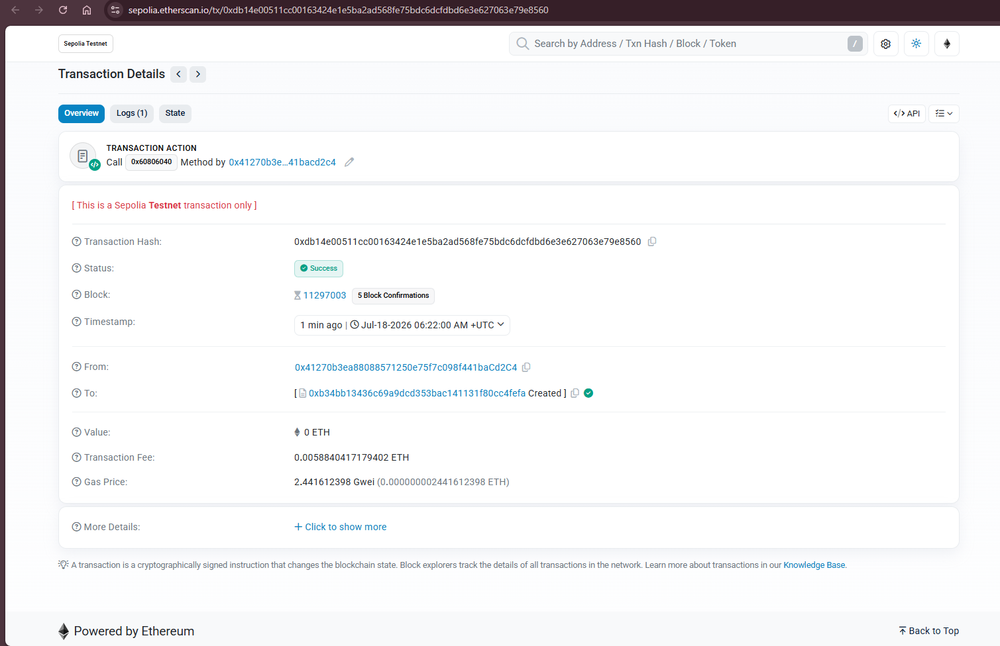
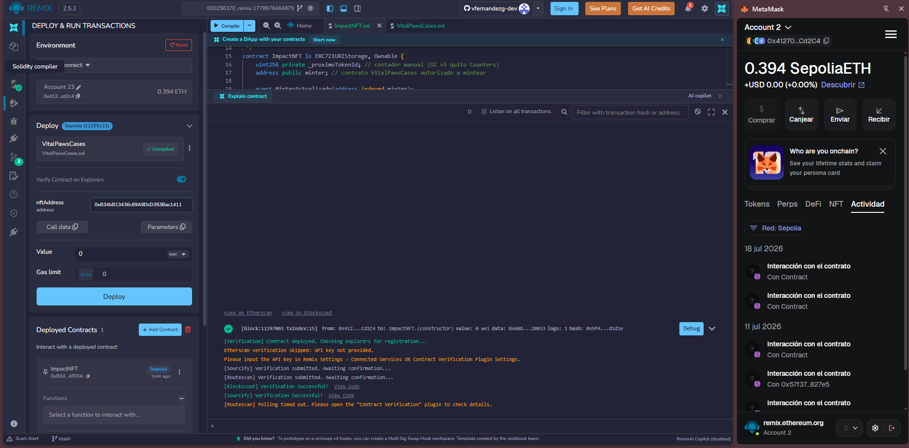
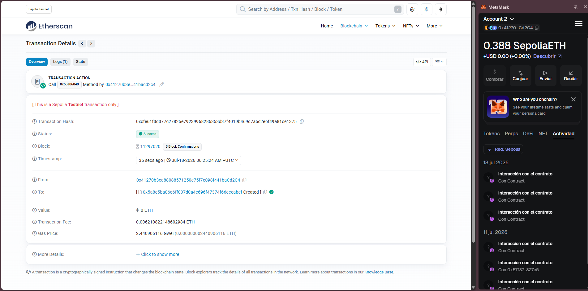
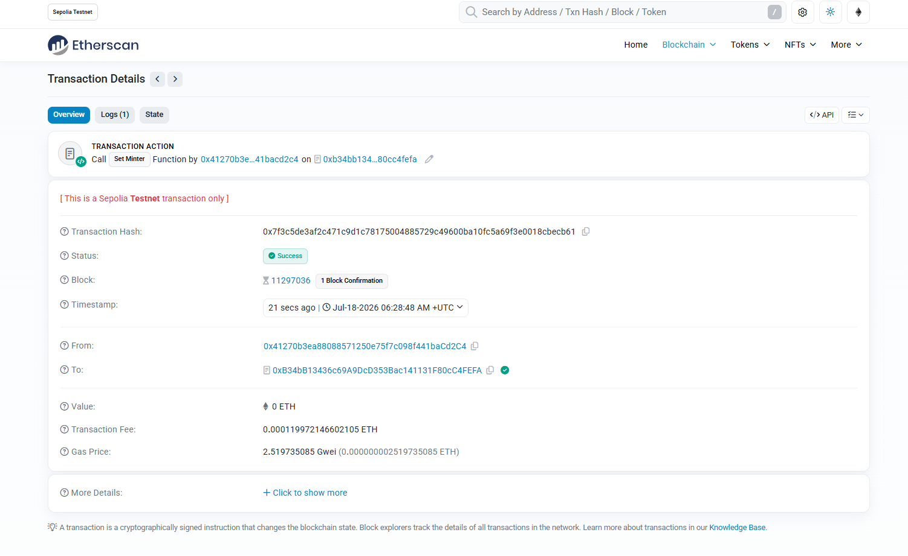

# Manual de despliegue — VitalPaws en Sepolia (Remix + MetaMask)

Guía reutilizable para desplegar los contratos y activar el modo on-chain de la app.
Stack de la guía del curso: **Remix IDE + OpenZeppelin v5 + MetaMask + Sepolia**.

> **Capturas:** este manual referencia imágenes en la carpeta [`capturas/`](capturas/).
> Guarda cada captura con el nombre exacto indicado (ver [Anexo: capturas](#anexo-capturas-a-guardar)) y se mostrarán solas.

---

## 0. Requisitos (una sola vez)

- **MetaMask** instalado, red **Sepolia** seleccionada.
- **ETH de prueba** (faucet, ~0.05 ETH):
  - <https://sepoliafaucet.com> · <https://www.alchemy.com/faucets/ethereum-sepolia>
- Cuenta que será **ADMIN** = el *owner* (quien despliega).

---

## 1. Cargar y compilar los contratos en Remix

1. Abre <https://remix.ethereum.org>. En `contracts/` crea `ImpactNFT.sol` y `VitalPawsCases.sol` y pega el contenido de `backend/contracts/contracts/`.
2. Pestaña **Solidity Compiler** → versión **0.8.20+** → **Compile**. Debe salir el check verde.



> Cualquier `0.8.20` o superior sirve (los contratos usan `^0.8.20`).

---

## 2. Desplegar `ImpactNFT`

1. Pestaña **Deploy & Run Transactions**.
2. **Environment** → `Injected Provider - MetaMask` (confirma **Sepolia 11155111** y tu cuenta).
3. **CONTRACT** → **`ImpactNFT`** (⚠️ no `IImpactNFT`).
4. **Deploy** → **Confirmar** en MetaMask.



5. En **Deployed Contracts** aparece `IMPACTNFT AT 0x…` → copia la dirección (`IMPACT_NFT_ADDRESS`).



6. La tx queda registrada en Etherscan (Status: Success).



> **Ejemplo real de este proyecto:** `IMPACT_NFT_ADDRESS = 0xB34bB13436c69A9DcD353Bac141131F80cC4FEFA`

---

## 3. Desplegar `VitalPawsCases`

1. **CONTRACT** → **`VitalPawsCases`**.
2. En el campo del parámetro **`nftAddress`** pega la dirección del `ImpactNFT`.
3. **Deploy** → **Confirmar** en MetaMask.



4. Copia la dirección del `VitalPawsCases` desplegado (`CASES_ADDRESS`).



> **Ejemplo real:** `CASES_ADDRESS = 0x5a8E5Ba06e6FF007d0a4c696f47374F66EeEabcF`

---

## 4. Autorizar el minter (paso clave)

El NFT solo deja mintear al contrato de casos.

1. En "Deployed Contracts", expande **`ImpactNFT`**.
2. Función **`setMinter`** → pega la dirección de `VitalPawsCases`.
3. **transact** → **Confirmar** en MetaMask.



> Si te lo saltas, `validar()` fallará con "No autorizado a mintear".

---

## 5. Poner las direcciones en la app

**`frontend/.env.local`:**
```
NEXT_PUBLIC_API_URL=http://localhost:4000
NEXT_PUBLIC_CHAIN_ID=11155111
NEXT_PUBLIC_CASES_ADDRESS=0x...       ← CASES_ADDRESS
NEXT_PUBLIC_IMPACT_NFT_ADDRESS=0x...  ← IMPACT_NFT_ADDRESS
```

**Reinicia el frontend** (Next lee env solo al arrancar):
```
cd frontend && pnpm run dev
```
Verifica: la ficha de un caso muestra **"Donar con MetaMask"** (no "Donar").

---

## 6. Roles (identidad = wallet)

- **ADMIN** = *owner* = la wallet que desplegó.
- **VET** = la dirección pasada en `crearCaso(meta, vet)` — debe ser **0x real**.
- **DONANTE** = cualquier otra wallet.

Cada rol = una cuenta de MetaMask; la app cambia de rol al cambiar de cuenta.

---

## 7. Problemas comunes

| Síntoma | Causa / arreglo |
|--------|-----------------|
| En Deploy solo aparece `IImpactNFT` | Es la *interfaz*. Elige `ImpactNFT` / `VitalPawsCases`. |
| Compiler 0.8.34 (u otra) | Cualquier `0.8.20+` sirve. |
| Botón "Donar" (no "con MetaMask") | Falta env o no reiniciaste el frontend. |
| "Cambia a Sepolia" | Cambia la red en MetaMask. |
| Deploy falla / insufficient funds | Sin ETH de faucet. |
| `validar()` revierte | Falta `setMinter`, o no eres el `vet`, o el caso no está en INSTALADA. |

---

## Resumen exprés

```
Remix → compilar (0.8.20)
Deploy ImpactNFT            → copia dir NFT
Deploy VitalPawsCases(NFT)  → copia dir CASES
ImpactNFT.setMinter(CASES)
frontend/.env.local ← CASES + NFT ; reiniciar frontend
```

---

## Capturas incluidas

Las imágenes están en `capturas/` (ya colocadas): `deploy-01-compilar.png` …
`deploy-07-setminter.png`, referenciadas en cada paso de este manual.
