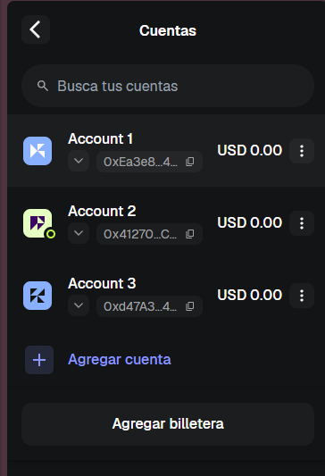
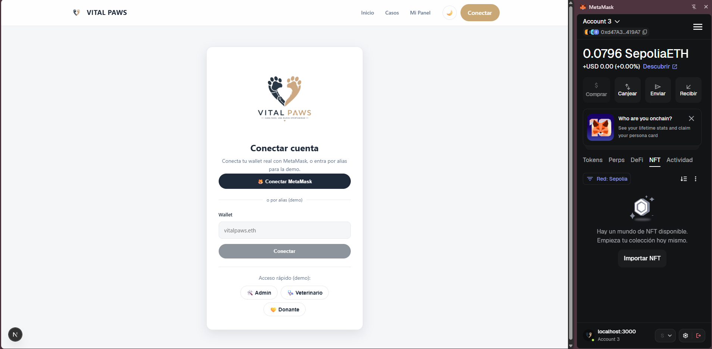
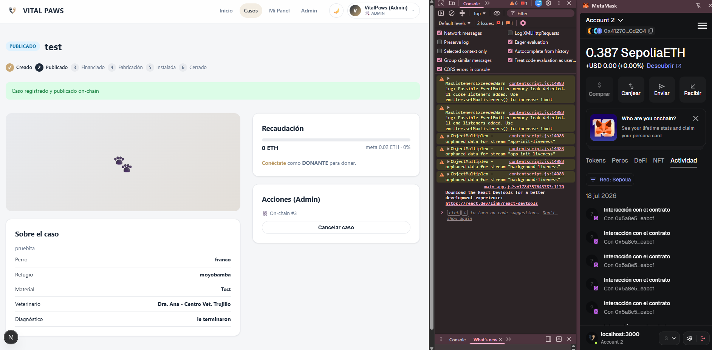
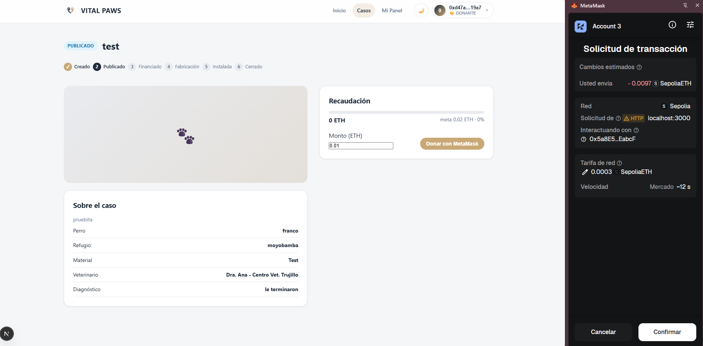
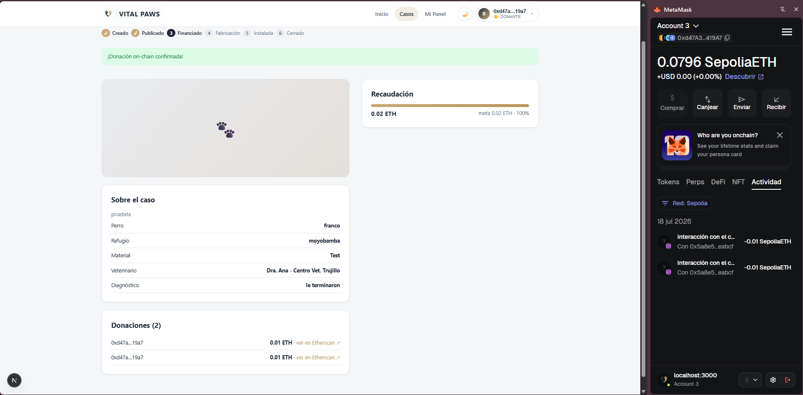
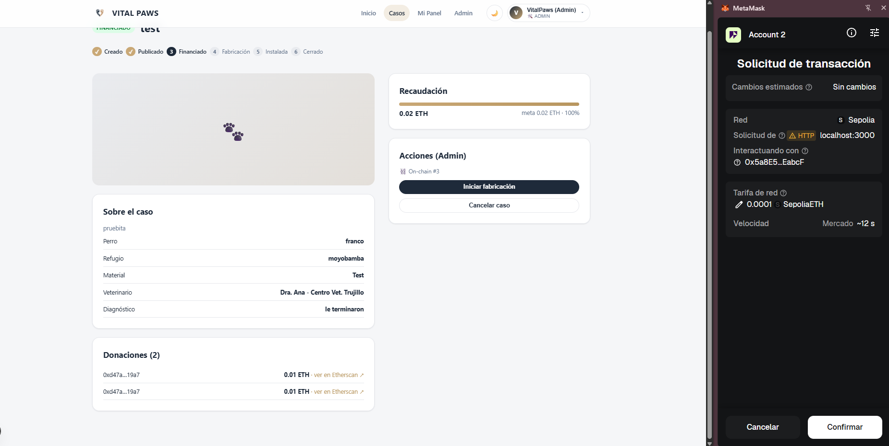
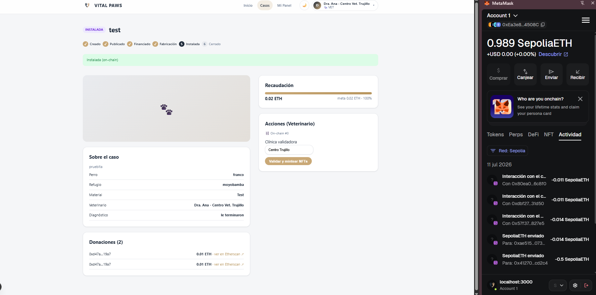
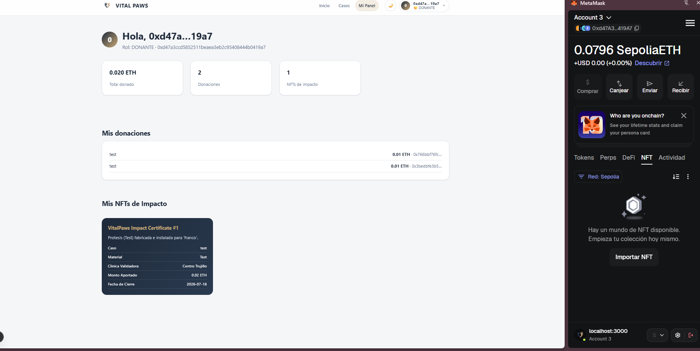

# Manual de usuario — VitalPaws DApp

Cómo usar la aplicación: conectar wallet, donar con MetaMask y seguir el ciclo de un caso
hasta recibir el **NFT de Impacto**. Todo sobre **Sepolia** (testnet).

> **Capturas:** referencia imágenes en [`capturas/`](capturas/). Guarda cada una con el nombre
> indicado en el [Anexo](#anexo-capturas-a-guardar) y se mostrarán solas.

---

## 0. Antes de empezar

- **MetaMask** en red **Sepolia**, con ETH de faucet.
- Backend y frontend corriendo:
  ```
  cd backend && pnpm run dev      # http://localhost:4000
  cd frontend && pnpm run dev     # http://localhost:3000
  ```
- **Roles = cuentas de MetaMask.** La app toma el rol de la **cuenta activa**:
  - Account 2 (owner) → **Admin**
  - Account 1 → **Veterinario**
  - Account 3 (u otra) → **Donante**



---

## 1. Conectar la wallet

En `/login`, click **🦊 Conectar MetaMask** (o los accesos demo por rol).
La app usa tu dirección como identidad; al cambiar de cuenta en MetaMask, cambia el rol.



---

## 2. Registrar un caso on-chain (Admin)

1. **MetaMask → cuenta ADMIN (owner)**.
2. Panel **Admin** → crea el caso (título, perro, refugio, **meta en ETH**, veterinario).
3. Abre el caso → **Registrar caso on-chain** → **firma 2 transacciones** (crear + publicar).
4. Queda **Publicado** con la etiqueta **⛓️ On-chain #N**.



> "Registrar caso on-chain" reemplaza a "Publicar": lo mete en el contrato **y** publica.

---

## 3. Donar con MetaMask (Donante)

1. **MetaMask → cuenta DONANTE**. La barra superior muestra 💛 DONANTE con tu dirección.
2. En el caso, escribe el **Monto (ETH)** → **Donar con MetaMask** → **Confirmar**.



3. La tx es real: el recaudado sube y cada donación enlaza a **Etherscan**.
4. Al alcanzar la meta, el caso pasa a **Financiado (100%)**.



---

## 4. Fabricar e instalar (Admin)

1. **MetaMask → ADMIN**.
2. **Iniciar fabricación** (firma) → estado **En fabricación**.
3. **Marcar instalada** (firma) → estado **Instalada**.



---

## 5. Validar y mintear el NFT (Veterinario)

1. **MetaMask → cuenta VET** (la registrada en el caso). La app se pone en 🩺 VET.
2. Escribe la **Clínica validadora** → **Validar y mintear NFTs** → **firma**.
3. El caso se **cierra** y se **acuña el NFT de Impacto** a la wallet del donante.



---

## 6. Ver tu NFT de Impacto (Donante)

1. **MetaMask → cuenta DONANTE** → **Mi Panel**.
2. Verás tus donaciones y el **certificado NFT** con sus atributos (caso, material, clínica, monto, fecha).



> Para verlo dentro de MetaMask: pestaña **NFT → Importar NFT** con la dirección del contrato
> `ImpactNFT` y el `tokenId` (ej. `1`).

---

## Resumen del ciclo (9 pasos)

```
Registrar on-chain (Admin) → Donar ETH (Donante) → Financiado
   → Fabricar → Instalar (Admin) → Validar (Vet) → NFT minteado → Cerrado
```
Cada acción firma con la **cuenta correspondiente**; el rol = la cuenta activa en MetaMask.

---

## Capturas incluidas

Las imágenes están en `capturas/` (ya colocadas):
`app-00-cuentas.png`, `app-01-login-metamask.png`, `app-03-registrar-onchain.png`,
`app-04-donar.png`, `app-05-financiado.png`, `app-06-fabricar-instalar.png`,
`app-07-validar.png`, `app-08-nft-dashboard.png`.
